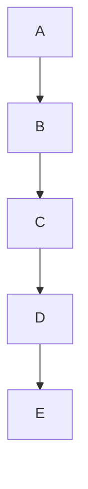

# A Blueprint for END to END automation for Support Staff in a Microsoft Environment

**What is Automation**

In this context Automation is the process of taking manual tasks, clearly defining the process logically and enabling a system to take on the task. The benefits of this can be:

Reduced Human Errors
Decreased Work Hours
Increase in overall producitivity

**How and through what mechanisms is Automation achieved?**

This can be achieved through different languages such as Powershell, Python and GUI based automation systems like PowerAutomate. APIs or SDKs can be utilized for third party systems.

This repository is for Automation of typical work tasks. 

The preference is for end to end automation with little human intervention.

**A**: User request planner Board

**B**: Power Automate Form gathers details

**C**: Technician's approval is sought for approval 

**D**: Microsoft Graph API is used to complete the task of creating planner board

**E**: End user is notified

This Script sends an email when the date matches todays date
Needs to Daily run with task scheduler in Windows

1) Add an entry to the csv main file, following the conventions
2) Let the task scheduler run through the script daily

To be included:

-Array for each scanning (at the moment can only take one event in the CSV, lol)
-Specify what level of time frame to scrutinize, ie Daily, Hours, minutes ets
